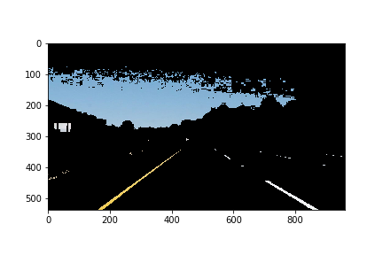
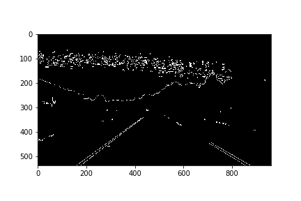
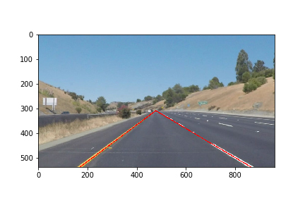

# **Finding Lane Lines on the Road** 

---

**Finding Lane Lines on the Road**

The goals / steps of this project are the following:
* Make a pipeline that finds lane lines on the road
* Reflect on your work in a written report

[//]: # (Image References)

[image1]: ./examples/grayscale.jpg "Grayscale"

---

### Reflection

### 1. Pipeline

My pipeline consists of five steps and works in all the given scenarios. First, 
- darker colors are removed by using the inRange() function,

- then the image is blurred with a Gaussian filter,
- the next step detects edges, then

- irrelevant regions of the image are removed (separate regions for left and right line),
- finally, the Hough algorithm is used to detect lines.
  

The detected lines are then filtered based on their slope, to remove unrealistic lines.

Beside the image processing pipeline two approaches are used to make the lane detection more robust. 
- For each lane line a different region of interest is used to minimize disturbances and wrongly detected lines
- The detect_line() function is called with different parameters in case no line could be detected

In order to draw the detected lane lines I use m and b from the two detected lines. The function calculate_intersection() calculates the 
- intersection point of the two lane lines,
- the intersection of the detected lines with the y axis, and
returns the coordinates. With these three coordinates a triangle (without base line) is drawn.

### 2. Potential Shortcomings with current Pipeline

Possible shortcomings of the lane line detection pipeline: 
- different lighting conditions, e.g. at night or artificial light
- in construction areas, when different line markers are used or old an new lines exist 
- damaged or old line markers, e.g. several (parallel) lines
- in cities, when left or right line is missing
- processing speed

### 3. Suggest Possible Improvements to your Pipeline

That's a good question, because how do we meassure improvement? We need the groundtruth to compare the result of our code changes against. 
I think one important step that is only very, very basic in the current pipeline is to determine the quality of the detected line. How certain are we that we really detected a line? Can we make predictions about the near future that the line detection will fail in two seconds?
When we have an algorithm in place that can determine the quality of the detected lines then we can improve our pipeline in a way that it adapts to chaning lighting conditions and at least works when lane lines are present.

 
